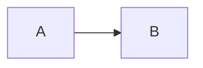
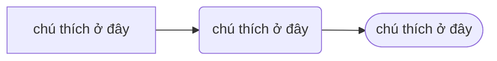
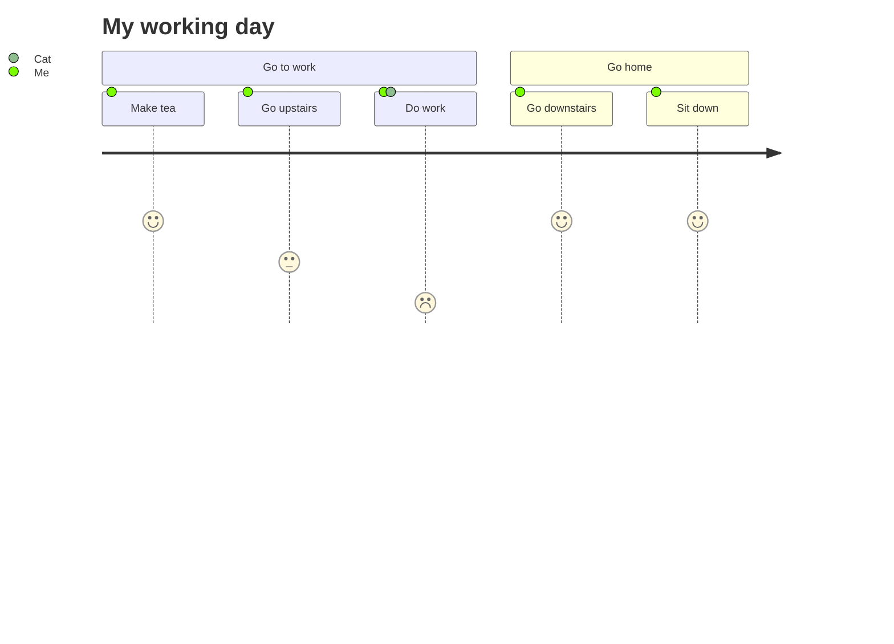

### Source
[Mermaid diagram githubpage](https://mermaid.js.org/syntax/flowchart.html)
## Cú pháp cơ bản flowchart
- LR left - right
- TB top - bottom
--- 
A --> B

A[chú thích ở đây] -->B(chú thích ở đây) --> C([chú thích ở đây]) 

